# AppVipTraining
Aplicação mobile utilizando Android Studio para gerenciar treinos de musculação utilizando a linguagem Kotlin.

Tópicos Implementados na Aplicação Mobile:
- Aplicação da Arquiteura MVVM ao projeto utilizando viewModels;
- Firebase Authentication para Cadastro de Usuário e Autenticação de Login do Usuário e Resete da senha via Email;
- Firebase Storage para o armazenamento do texto do Treino adicionado pelo Usuário;
- Firebase Storage para o armazenamento das Imagens do Treino e da Foto do Perfil do Usuário;
- Firebase Firestore para armazenar as Entidades Treino e Exercício ao banco de dados;
- Tela de Abertura com animação utilizando a biblioteca Lottie;
- Shared Preferences para armazenar o nome, data de nascimento, peso, altura e imagem do Avatar do Perfil do Usuário; 
- Componentes do Material Design para criar os Layout das Telas;

## PROTÓTIPO DAS TELAS DO APLICATIVO NO FIGMA

### Link com as telas desenhadas no Figma: [Figma](https://www.figma.com/file/J2iXG58WH6qTUWO2nrHEsg/Fitness-App-UI-Design?node-id=0%3A1)

## TELA DE ABERTURA DO APLICATIVO

## TELA DE BOAS VINDAS

## TELA DE LOGIN

## TELA DE CADASTRO DE USUÁRIO

## TELA DE MENU PRINCIPAL

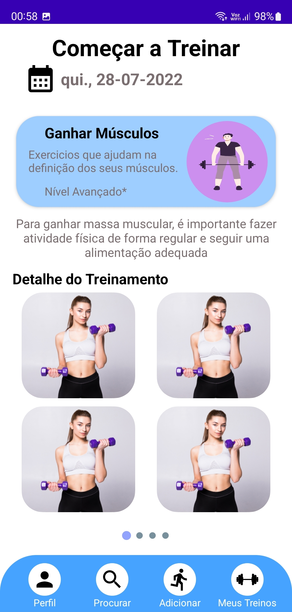

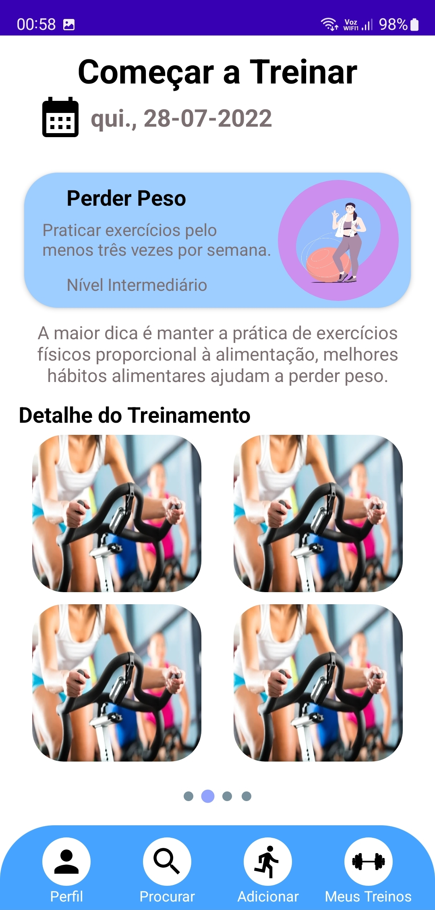

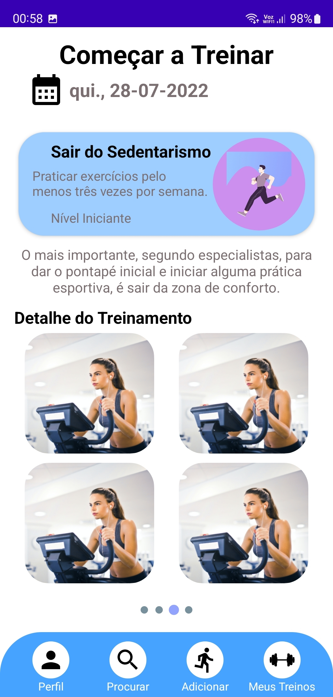

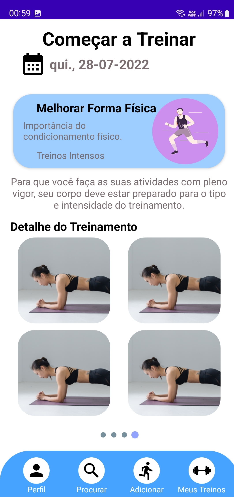

## TELA EDITAR PERFIL

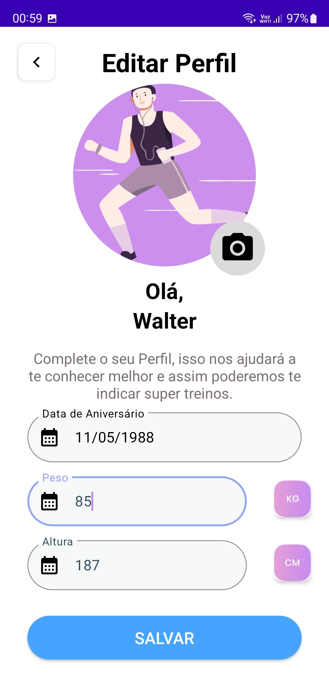

## TELA DE PESQUISA DE TREINO

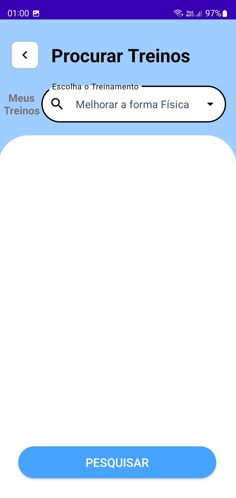

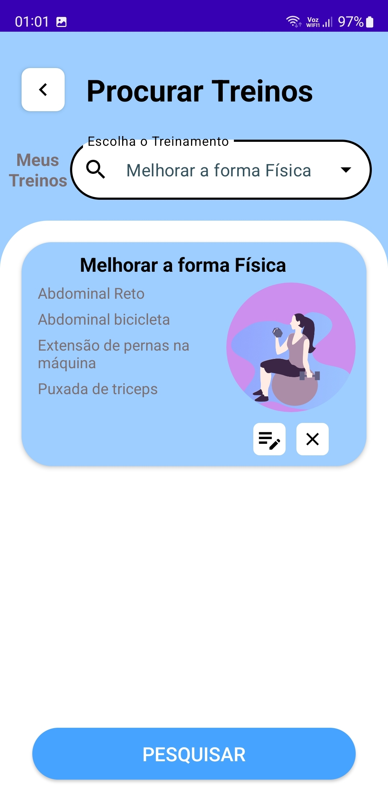

## TELA DE ADICIONAR TREINO / EXERCÍCIO

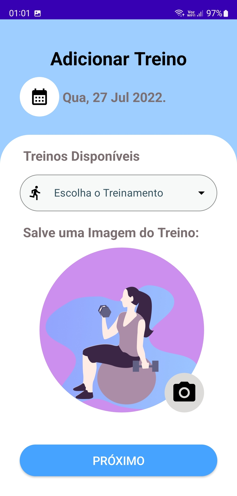

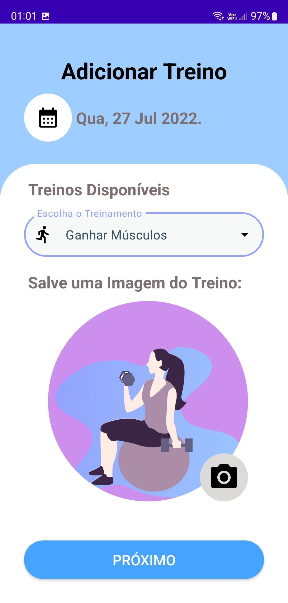

## TELA DE MEUS TREINOS SALVOS

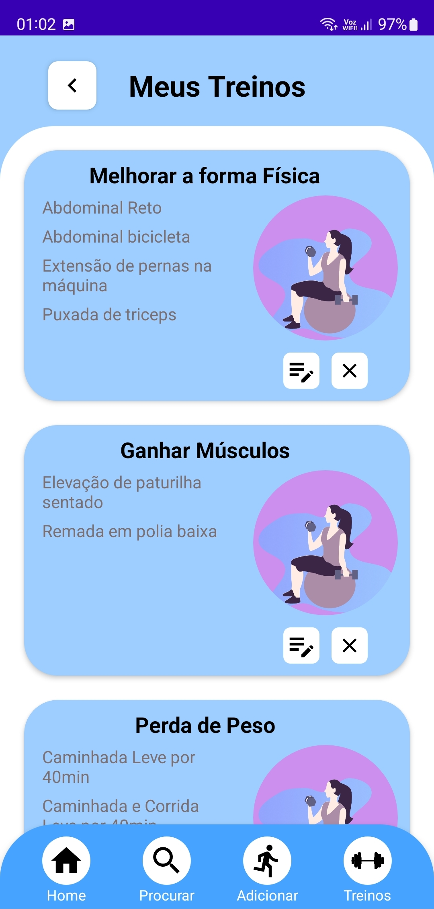

## TELA COM A OPÇÃO DE DELETAR ITEM

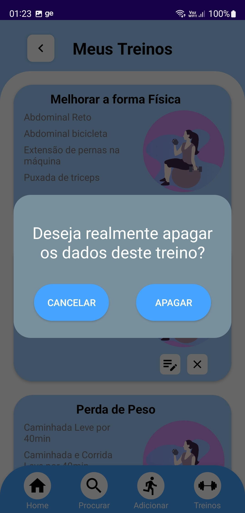

## TELA COM A OPÇÃO DE EDITAR ITEM

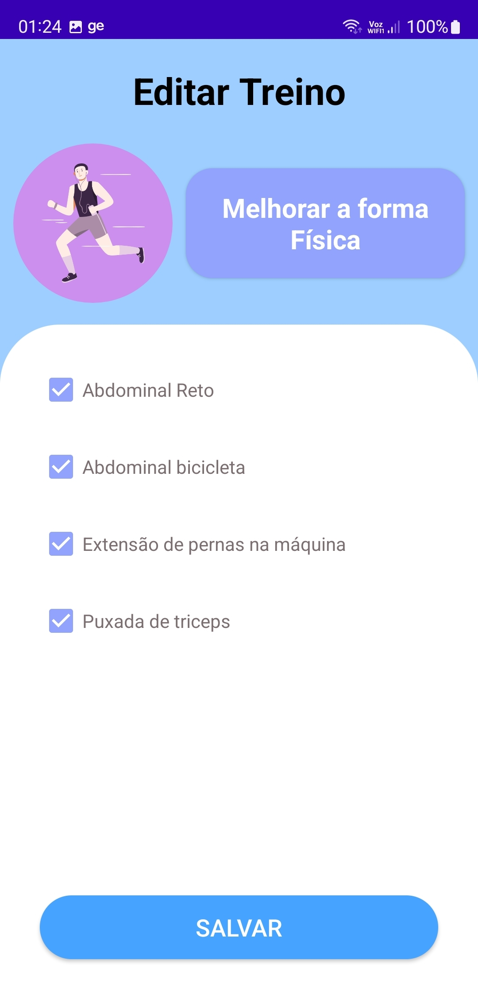

## TELA CONSOLE FIREBASE

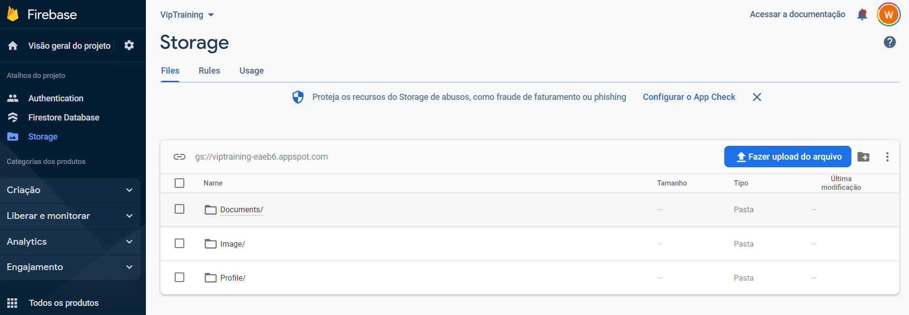

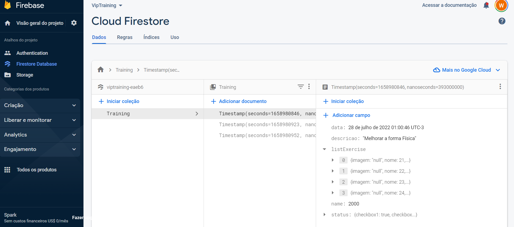

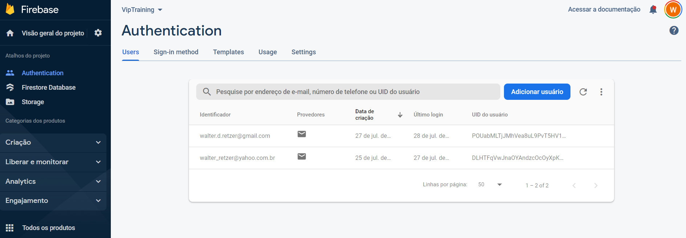